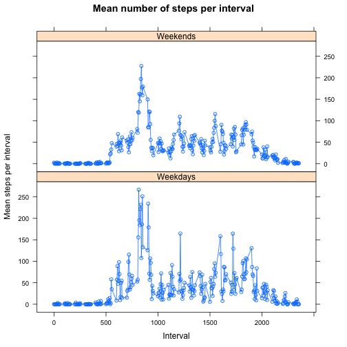

# Reproducible Research: Peer Assessment 1, Eino Palin
This code requires plyr, lattice packages.
Also, the source file should be unzipped to the working directory


## Loading and preprocessing the data
Read the source data and convert the dates to correct format

```r
amd <- read.csv("activity.csv", header=TRUE)
amd$date <- as.Date(amd$date)
library(plyr)
library(lattice)
```

## What is mean total number of steps taken per day?

First, summarise the data with ddply, calculate the sum of steps per day and median and mean per day. Then make a histogram of the results and finally print the sum, mean and median per day


```r
sum_amd <- ddply(amd, "date", summarise, amdSum=sum(steps), amdMean=mean(steps), amdMedian=median(steps))
hist(sum_amd$amdSum, xlab="Sum of steps taken", main="Total amount of steps taken per day")
```

 

```r
dev.copy(png, file="figures/plot1.png")
```

```
## quartz_off_screen 
##                 5
```

```r
dev.off
```

```
## function (which = dev.cur()) 
## {
##     if (which == 1) 
##         stop("cannot shut down device 1 (the null device)")
##     .External(C_devoff, as.integer(which))
##     dev.cur()
## }
## <bytecode: 0x7fabc57f0f08>
## <environment: namespace:grDevices>
```

```r
sum_amd
```

```
##          date amdSum amdMean amdMedian
## 1  2012-10-01     NA      NA        NA
## 2  2012-10-02    126  0.4375         0
## 3  2012-10-03  11352 39.4167         0
## 4  2012-10-04  12116 42.0694         0
## 5  2012-10-05  13294 46.1597         0
## 6  2012-10-06  15420 53.5417         0
## 7  2012-10-07  11015 38.2465         0
## 8  2012-10-08     NA      NA        NA
## 9  2012-10-09  12811 44.4826         0
## 10 2012-10-10   9900 34.3750         0
## 11 2012-10-11  10304 35.7778         0
## 12 2012-10-12  17382 60.3542         0
## 13 2012-10-13  12426 43.1458         0
## 14 2012-10-14  15098 52.4236         0
## 15 2012-10-15  10139 35.2049         0
## 16 2012-10-16  15084 52.3750         0
## 17 2012-10-17  13452 46.7083         0
## 18 2012-10-18  10056 34.9167         0
## 19 2012-10-19  11829 41.0729         0
## 20 2012-10-20  10395 36.0938         0
## 21 2012-10-21   8821 30.6285         0
## 22 2012-10-22  13460 46.7361         0
## 23 2012-10-23   8918 30.9653         0
## 24 2012-10-24   8355 29.0104         0
## 25 2012-10-25   2492  8.6528         0
## 26 2012-10-26   6778 23.5347         0
## 27 2012-10-27  10119 35.1354         0
## 28 2012-10-28  11458 39.7847         0
## 29 2012-10-29   5018 17.4236         0
## 30 2012-10-30   9819 34.0938         0
## 31 2012-10-31  15414 53.5208         0
## 32 2012-11-01     NA      NA        NA
## 33 2012-11-02  10600 36.8056         0
## 34 2012-11-03  10571 36.7049         0
## 35 2012-11-04     NA      NA        NA
## 36 2012-11-05  10439 36.2465         0
## 37 2012-11-06   8334 28.9375         0
## 38 2012-11-07  12883 44.7326         0
## 39 2012-11-08   3219 11.1771         0
## 40 2012-11-09     NA      NA        NA
## 41 2012-11-10     NA      NA        NA
## 42 2012-11-11  12608 43.7778         0
## 43 2012-11-12  10765 37.3785         0
## 44 2012-11-13   7336 25.4722         0
## 45 2012-11-14     NA      NA        NA
## 46 2012-11-15     41  0.1424         0
## 47 2012-11-16   5441 18.8924         0
## 48 2012-11-17  14339 49.7882         0
## 49 2012-11-18  15110 52.4653         0
## 50 2012-11-19   8841 30.6979         0
## 51 2012-11-20   4472 15.5278         0
## 52 2012-11-21  12787 44.3993         0
## 53 2012-11-22  20427 70.9271         0
## 54 2012-11-23  21194 73.5903         0
## 55 2012-11-24  14478 50.2708         0
## 56 2012-11-25  11834 41.0903         0
## 57 2012-11-26  11162 38.7569         0
## 58 2012-11-27  13646 47.3819         0
## 59 2012-11-28  10183 35.3576         0
## 60 2012-11-29   7047 24.4688         0
## 61 2012-11-30     NA      NA        NA
```

## What is the average daily activity pattern?
First, calculate the mean number of steps taken per time interval, across all days, then plot the results and print the interval where the maximum number of steps occur

```r
mean_interval <- ddply(amd, "interval", summarise, intervallMean=mean(steps, na.rm=TRUE))
plot(mean_interval$interval, mean_interval$intervallMean, type="l", xlab="Time interval", ylab="Mean amount of steps")
```

 

```r
dev.copy(png, file="figures/plot2.png")
```

```
## quartz_off_screen 
##                 6
```

```r
dev.off
```

```
## function (which = dev.cur()) 
## {
##     if (which == 1) 
##         stop("cannot shut down device 1 (the null device)")
##     .External(C_devoff, as.integer(which))
##     dev.cur()
## }
## <bytecode: 0x7fabc57f0f08>
## <environment: namespace:grDevices>
```

```r
mean_interval[which.max(mean_interval$intervallMean),]
```

```
##     interval intervallMean
## 104      835         206.2
```

## Imputing missing values

First, calculate the amount rows with missing values, then replace the missing values with the correct interval mean, use ddply to calculate the sum of steps per day and median and mean per day, plot the results and print the new sum, mean and median per day

```r
sum(is.na(amd))
```

```
## [1] 2304
```

```r
amd[is.na(amd$steps) == "TRUE", 1] <- mean_interval$intervallMean
sum_amd_new <- ddply(amd, "date", summarise, amdSum=sum(steps), amdMean=mean(steps), amdMedian=median(steps))
hist(sum_amd_new$amdSum, xlab="Sum of steps taken", main="Total amount of steps taken per day (missing values removed)")
```

 

```r
dev.copy(png, file="figures/plot3.png")
```

```
## quartz_off_screen 
##                 7
```

```r
dev.off
```

```
## function (which = dev.cur()) 
## {
##     if (which == 1) 
##         stop("cannot shut down device 1 (the null device)")
##     .External(C_devoff, as.integer(which))
##     dev.cur()
## }
## <bytecode: 0x7fabc57f0f08>
## <environment: namespace:grDevices>
```

```r
sum_amd_new
```

```
##          date amdSum amdMean amdMedian
## 1  2012-10-01  10766 37.3826     34.11
## 2  2012-10-02    126  0.4375      0.00
## 3  2012-10-03  11352 39.4167      0.00
## 4  2012-10-04  12116 42.0694      0.00
## 5  2012-10-05  13294 46.1597      0.00
## 6  2012-10-06  15420 53.5417      0.00
## 7  2012-10-07  11015 38.2465      0.00
## 8  2012-10-08  10766 37.3826     34.11
## 9  2012-10-09  12811 44.4826      0.00
## 10 2012-10-10   9900 34.3750      0.00
## 11 2012-10-11  10304 35.7778      0.00
## 12 2012-10-12  17382 60.3542      0.00
## 13 2012-10-13  12426 43.1458      0.00
## 14 2012-10-14  15098 52.4236      0.00
## 15 2012-10-15  10139 35.2049      0.00
## 16 2012-10-16  15084 52.3750      0.00
## 17 2012-10-17  13452 46.7083      0.00
## 18 2012-10-18  10056 34.9167      0.00
## 19 2012-10-19  11829 41.0729      0.00
## 20 2012-10-20  10395 36.0938      0.00
## 21 2012-10-21   8821 30.6285      0.00
## 22 2012-10-22  13460 46.7361      0.00
## 23 2012-10-23   8918 30.9653      0.00
## 24 2012-10-24   8355 29.0104      0.00
## 25 2012-10-25   2492  8.6528      0.00
## 26 2012-10-26   6778 23.5347      0.00
## 27 2012-10-27  10119 35.1354      0.00
## 28 2012-10-28  11458 39.7847      0.00
## 29 2012-10-29   5018 17.4236      0.00
## 30 2012-10-30   9819 34.0938      0.00
## 31 2012-10-31  15414 53.5208      0.00
## 32 2012-11-01  10766 37.3826     34.11
## 33 2012-11-02  10600 36.8056      0.00
## 34 2012-11-03  10571 36.7049      0.00
## 35 2012-11-04  10766 37.3826     34.11
## 36 2012-11-05  10439 36.2465      0.00
## 37 2012-11-06   8334 28.9375      0.00
## 38 2012-11-07  12883 44.7326      0.00
## 39 2012-11-08   3219 11.1771      0.00
## 40 2012-11-09  10766 37.3826     34.11
## 41 2012-11-10  10766 37.3826     34.11
## 42 2012-11-11  12608 43.7778      0.00
## 43 2012-11-12  10765 37.3785      0.00
## 44 2012-11-13   7336 25.4722      0.00
## 45 2012-11-14  10766 37.3826     34.11
## 46 2012-11-15     41  0.1424      0.00
## 47 2012-11-16   5441 18.8924      0.00
## 48 2012-11-17  14339 49.7882      0.00
## 49 2012-11-18  15110 52.4653      0.00
## 50 2012-11-19   8841 30.6979      0.00
## 51 2012-11-20   4472 15.5278      0.00
## 52 2012-11-21  12787 44.3993      0.00
## 53 2012-11-22  20427 70.9271      0.00
## 54 2012-11-23  21194 73.5903      0.00
## 55 2012-11-24  14478 50.2708      0.00
## 56 2012-11-25  11834 41.0903      0.00
## 57 2012-11-26  11162 38.7569      0.00
## 58 2012-11-27  13646 47.3819      0.00
## 59 2012-11-28  10183 35.3576      0.00
## 60 2012-11-29   7047 24.4688      0.00
## 61 2012-11-30  10766 37.3826     34.11
```

## Are there differences in activity patterns between weekdays and weekends?

First, add the new factor variable, isWeekday, then calculate the mean number of steps and plot the results

```r
amd$isWeekday <- !(weekdays(sum_amd$date)) %in% c('Saturday','Sunday')
steps_mean_wday <- ddply(amd, c("interval","isWeekday"), summarise, amd_Wday_mean=mean(steps))
xyplot(amd_Wday_mean ~ interval | isWeekday  , data=steps_mean_wday, type="b", xlab = "Interval", ylab ="Mean steps per interval", main="Mean number of steps per interval", strip=strip.custom(factor.levels=c("Weekdays", "Weekends")),layout=c(1,2))
```

 

```r
dev.copy(png, file="figures/plot4.png")
```

```
## quartz_off_screen 
##                 8
```

```r
dev.off
```

```
## function (which = dev.cur()) 
## {
##     if (which == 1) 
##         stop("cannot shut down device 1 (the null device)")
##     .External(C_devoff, as.integer(which))
##     dev.cur()
## }
## <bytecode: 0x7fabc57f0f08>
## <environment: namespace:grDevices>
```
